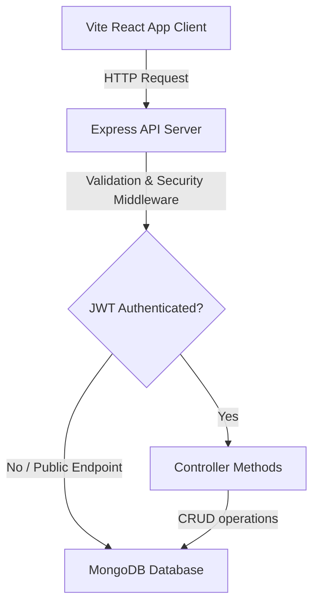

# Portfolio System Architecture

This document maps out the system flow, directory structure, and authentication mechanics.

## Architecture Flow



## Directory Structure

```
project-root/
│
├── frontend/                     # React Single Page App
│   ├── public/                   # Static mock images & logo files
│   └── src/
│       ├── components/           # UI section views (Navbar, Hero, Projects, Skills)
│       ├── context/              # Context Providers (AuthContext.jsx)
│       ├── pages/                # Main router entrypages (Home, Login, Dashboard)
│       ├── services/             # Axios API calls (projectService, authService)
│       └── App.jsx               # App routing wrapper
│
├── backend/                      # Express REST API Service
│   └── src/
│       ├── config/               # DB connection settings
│       ├── controllers/          # Business logic handlers
│       ├── middleware/           # Protected admin auth & error hooks
│       ├── models/               # Mongoose DB Schemas
│       ├── routes/               # Express endpoint definitions
│       ├── validations/          # Request payload validators
│       └── server.js             # Express startup file
│
├── database/                     # DB schemas, seeds, & documentation
│   └── seeders/                  # seed.js initialization script
│
└── docs/                         # Deployment and API documentation
```

## Authentication & Security Flow

1. **Password Hashing:**
   Admin password is encrypted inside a pre-save Mongoose hook using `bcryptjs` (10 salt rounds) when seeded or created.
   
2. **JWT Authorization:**
   When logging in successfully at `/api/auth/login`, the backend signs a JSON Web Token payload containing the user's Mongoose ID (`id`) using the secret key `JWT_SECRET`. This token is returned in the response JSON.

3. **Bearer Injector:**
   The frontend Axios interceptor injects the stored token as a `Bearer <token>` inside the `Authorization` request header for subsequent requests.

4. **Security Middlewares:**
   - **CORS:** Restricts requests to registered domain origins.
   - **Helmet:** Enforces security headers on every response.
   - **Rate Limiting:** Prevents denial-of-service attempts.
